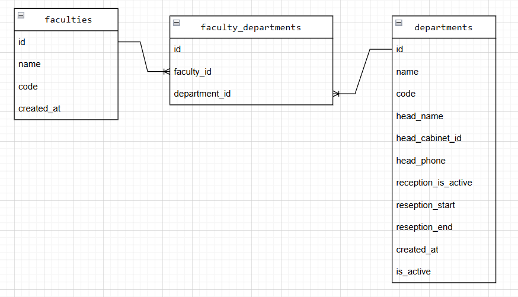

# S5 Faculty Service - Справочник отделений СПО

## Сущность: Department (Отделение)

### 1. Информация для создания сущности

| Параметр | Пояснение | Обязательность | Тип | Ограничение | Значение по умолчанию |
|----------|-----------|----------------|-----|-------------|----------------------|
| name | Название отделения | Да | string | 2-200 символов | — |
| code | Шифр направления подготовки | Да | string | 2-20 символов | — |
| head_name | ФИО заведующего отделением | Да | string | 2-150 символов | — |
| head_specialty | Специальность заведующего | Нет | string | 2-200 символов | null |
| head_phone | Телефон заведующего | Нет | string | 2-20 символов | null |
| head_email | Email заведующего | Нет | string | до 255 символов | null |
| head_cabinet_id | Номер кабинета заведующего | Нет | integer | любое целое число | null |
| reception_is_active | Активен ли приём | Нет | boolean | true/false | false |
| reception_schedule | Время приёма заведующего | Нет | string | 2-500 символов | null |

**Уникальные комбинации параметров:** (name, code)

### 2. Информация, возвращаемая при успешном создании

| Параметр | Тип |
|----------|-----|
| id | integer |
| name | string |
| code | string |
| head_name | string |
| head_specialty | string \| null |
| head_phone | string \| null |
| head_email | string \| null |
| head_cabinet_id | integer \| null |
| reception_is_active | boolean |
| reception_schedule | string \| null |
| created_at | datetime |
| is_active | boolean |

## Изменить сущность по ID

**Входной параметр:** `id` (integer) - уникальный идентификатор отделения

### 3. Информация для изменения сущности

| Параметр | Пояснение | Обязательность | Тип | Ограничение |
|----------|-----------|----------------|-----|-------------|
| name | Название отделения | Нет | string | 2-200 символов |
| code | Шифр направления подготовки | Нет | string | 2-20 символов |
| head_name | ФИО заведующего отделением | Нет | string | 2-150 символов |
| head_specialty | Специальность заведующего | Нет | string | 2-200 символов |
| head_phone | Телефон заведующего | Нет | string | 2-20 символов |
| head_email | Email заведующего | Нет | string | до 255 символов |
| head_cabinet_id | Номер кабинета заведующего | Нет | integer | любое целое число |
| reception_is_active | Активен ли приём | Нет | boolean | true/false |
| reception_schedule | Время приёма заведующего | Нет | string | 2-500 символов |

### 4. Информация, возвращаемая при успешном изменении

| Параметр | Тип |
|----------|-----|
| id | integer |
| name | string |
| code | string |
| head_name | string |
| head_specialty | string \| null |
| head_phone | string \| null |
| head_email | string \| null |
| head_cabinet_id | integer \| null |
| reception_is_active | boolean |
| reception_schedule | string \| null |
| created_at | datetime |
| is_active | boolean |

## Удалить сущность по ID

**Входной параметр:** `id` (integer) - уникальный идентификатор отделения

**Возвращаемое значение:** `True`, если отделение было удалено, иначе `False`

## Получить сущность по ID

**Входной параметр:** `id` (integer) - уникальный идентификатор отделения

### 5. Информация, возвращаемая при успешном поиске

| Параметр | Пояснение | Тип |
|----------|-----------|-----|
| id | Уникальный номер отделения | integer |
| name | Название отделения | string |
| code | Шифр направления подготовки | string |
| head_name | ФИО заведующего отделением | string |
| head_specialty | Специальность заведующего | string \| null |
| head_phone | Телефон заведующего | string \| null |
| head_email | Email заведующего | string \| null |
| head_cabinet_id | Номер кабинета заведующего | integer \| null |
| reception_is_active | Активен ли приём | boolean |
| reception_schedule | Время приёма заведующего | string \| null |
| created_at | Дата и время создания записи | datetime |
| is_active | Активна ли запись | boolean |

## Получить список сущностей по заданным параметрам

### 6. Параметры для получения списка

| Параметр | Пояснение | Тип |
|----------|-----------|-----|
| page | Номер страницы (пагинация) | integer |
| size | Количество записей на странице | integer |
| name | Поиск по части названия отделения | string |

### 7. Информация, возвращаемая в виде списка сущностей

| Параметр | Тип |
|----------|-----|
| id | integer |
| name | string |
| code | string |
| head_name | string |
| head_specialty | string \| null |
| head_phone | string \| null |
| head_email | string \| null |
| head_cabinet_id | integer \| null |
| reception_is_active | boolean |
| reception_schedule | string \| null |
| created_at | datetime |
| is_active | boolean |

## ER-диаграмма

